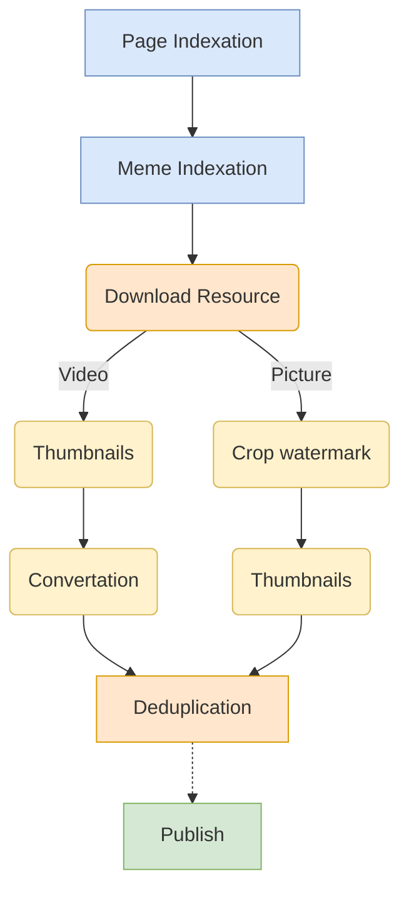

# iFunny

Сайт: https://ifunny.ruslanys.me 

Задание: https://funcodechallenge.com/

## Преамбула

Во-первых, хочу поблагодарить организаторов за конкурс.
Нужно сказать, что мне вообще всегда нравилось скрапить сайты. Я даже [гонял](https://github.com/ruslanys/vkmusic)
обфусцированный код на JS, который удалось выдрать с фронта ВК, под Nashorn, чтобы декодировать путь до MP3 файлов.
Закончилось, правда, тем, что я устал играть в догонялки и выпускать апдейты и подзабил.

Во-вторых, я не часто участвую в каких-либо конкурсах, потому что я фанатик. Я очень увлечённый программированием человек.
Да и вообще, в принципе, увлекающийся человек. Последний раз я участвовал в первом Highloadcup в 2017. 
Моё решение было пятым среди Java, но ниже 50го в общем зачёте. И должен сказать, FunCode Challenge умнее, сложнее,
реальнее и интереснее. В Highloadcup дрочишь профайлер две недели, а побеждает Си на костылях с epoll(0). Ну бред. 

Разрабатывая это решение, азарт был не просто в конкурсе, а в самом проекте, в идее, в сути.
Это не академическая задача, а вполне реальная и совсем нетривиальная. Хотя это не очевидно.

Можно ли представить, что решение для того же Highloadcup будет развёрнуто на личных серверах просто ради удовольствия?
Не думаю. Разворачивая это решение я очень боялся, что каааак выкачаю сейчас все интернеты и мне не хватит либо места,
либо денег. Но уже через несколько дней появилась какая-то страсть, азарт, жажда накачать больше и больше.
И уже сотни гигабайт не стали казаться большим объемом.
Никогда бы не подумал, что у меня будет под полтерабайта мемов на немецком, французском и прочих незнакомых мне языках.

Я уже довольно давно [пишу](https://github.com/ruslanys) на Kotlin, но к своему стыду совсем не пробовал корутины.
Я понимаю как они работают, что такое реактивный подход и что такое NIO.
Откровенно говоря, NIO вообще было темой моей дипломной работы в своё время.
Но почему-то хайп относительно этого подхода случился совсем недавно. Кстати, по этой же причине, я считаю,
можно наблюдать рост популярности декларативного (функционального) программирования.
И мне не до конца очевидны причины такого ажиотажа. Почему именно сейчас? Все это было доступно уже давно.

Понятное дело, что есть проекты, нуждающиеся в NIO, которые то и делают, что тратят треды на блокировку IO.
Но асинхронный код труднее писать, поддерживать, понимать. У человека вообще склад ума таков,
что параллельные и асинхронные взаимодействия даются трудно к восприятию.
Однако Грейс Мюррей еще в 1962 году писала:
«Совершенно очевидно, что нам следует отказаться от последовательного выполнения операций и не ограничивать компьютеры им.
Мы должны формулировать определения, расставлять приоритеты и давать описания данных.
Мы должны формулировать связи, а не процедуры.»

Абсолютно очевидно, что данный проект — идеальный кандидат на реализацию реактивного подхода,
т.к. преимущественно занимается сетевыми вызовами и ожиданием операций ввода-вывода. 

Однако лучше Tomcat в руках, чем Netty в небе, решил я и взялся за саму задачу на блокируемых потоках, как привычно,
а дальше запланировал готовое приложение перенести на NIO. Хватило бы времени...

Так появилось две версии приложения:
* [1.X.X](https://gitlab.com/ruslanys/ifunny/tree/1.x.x) на блокируемых потоках
* [2.X.X](https://gitlab.com/ruslanys/ifunny/tree/master) на неблокируемых потоках и реактивном подходе

Я бы очень хотел, чтобы обе версии были взяты во внимание. Несмотря на то, что блокировка потоков для работы с сетью –
не лучшая идея, в целом я доволен реализацией первой версии. Она, кстати, получилась даже весьма эффективной.

P.S. Сорри за лонгрид. Люблю обсуждать технические детали.
Многое хочется рассказать, многим хочется поделиться, а не с кем.
Поэтому, буду надеяться, что тебе, читатель, будет не менее интересно это читать, чем мне разрабатывать. 


## Сборка

### Сборка приложения

Для того, чтобы собрать приложение, необходимо иметь предустановленную JDK ≥ 8 и выполнить следующую команду:

```
$ ./gradlew assemble
```

### Сборка приложения с тестами

Дело в том, что тесты, требующие БД производятся против реального сервера БД. 
На мой личный взгляд это один (или самый) из самых надежных способов тестирования. 

Сложность заключается лишь в развёртывании необходимого окружения. 
В случае с CI/CD, GitLab Pipeline настроен таким образом, что перед сборкой поднимаются нужные сервисы и линкуются с тестируемым образом.

Для того, чтобы локально добиться того же результата, был создан `docker-compose.yml` файл.  

Итак, для сборки приложения с запуском всех тестов локально необходимо выполнить две команды:

```
$ docker-compose up -d
$ ./gradlew build
```

### Сборка Docker образа

Прежде, чем приступить к сборке Docker образа необходимо собрать само приложение. 
Необходимые шаги подробно описаны в соответствующем разделе.

Как только приложение создано, сборка Docker образа становится тривиальной задачей:

```
$ docker build -t ifunny .
```

### Версионирование

Приложение версионируется на основе git тагов. Так, если последний коммит затаган с префиксом `v`, например `v1.0.0`,
тогда версия приложения будет равна имени тага без префикса: `1.0.0`.

Однако если последний коммит впереди, то минорный разряд будет увеличен на единицу и добавлен постфикс `-SNAPSHOT`.
Например: `1.1.0-SNAPSHOT`.

## Запуск

### Системные требования

Во-первых, при запуске JVM в Docker-контейнере есть свои особенности. Конечно, вы наверняка знаете о них.
Но если вкратце – необходимо явно задавать ограничения приложению на ресурсы через опции JVM. 

Обратите внимание на заданные параметры JVM из Dockerfile:

* `-Xms2G`/`-Xmx2G` – размер кучи (heap'а). Минимальное рекомендуемое значение 2 ГБ в случае 8 ядерного (или меньше) процессора.
В случае, если ядер больше, памяти нужно больше.
* `-XX:MaxDirectMemorySize=1G` – размер нативной памяти. Дело в том, что Netty большой любитель Unsafe и нативных буферов,
поэтому этот параметр нужно обязательно задать, чтобы не словить сюрпризов. Минимальное рекомендуемое значение 1 ГБ,
хотя на деле должно работать и с меньшим количеством нативной памяти (от 512 МБ).
* `-XX:MaxMetaspaceSize=256M` – для того, чтобы в продакшене не было сюрпризов, устанавливаем размер Metaspace раздела.
256 МБ достаточно.

#### Примечание.

С указанными выше параметрами я запускал приложение в Docker с приказом пристрелить, если потребляемая память пересекает
границу в 3500 МБ.

Примерно через 6-7 часов все разработанные источники были полностью проиндексировны, используя одну виртуальную машину
с 2 ядрами ЦП и 4 ГБ оперативной памяти. 

### Переменные окружения

#### MongoDB

* `MONGODB_HOST` – Хост сервера MongoDB (По умолчанию `localhost`).
* `MONGODB_PORT` – Порт сервера MongoDB (По умолчанию `27017`)
* `MONGODB_DATABASE` - Имя базы данных MongoDB (По умолчанию `ifunny`).
* `MONGODB_USERNAME` – Имя пользователя MongoDB (По умолчанию `ifunny`).
* `MONGODB_PASSWORD` – Пароль пользователя MongoDB (По умолчанию `ifunny`).
* `MONGODB_AUTH_DB` – База данных аутентификации MongoDB (По умолчанию `admin`).

#### AWS S3

* `AWS_S3_ACCESS_KEY` – [Ключ доступа](https://docs.aws.amazon.com/sdk-for-java/v2/developer-guide/signup-create-iam-user.html) к S3. 
* `AWS_S3_SECRET_KEY` – [Ключ доступа](https://docs.aws.amazon.com/sdk-for-java/v2/developer-guide/signup-create-iam-user.html) к S3. 
* `AWS_S3_REGION` – S3 Регион.
* `AWS_S3_BUCKET` – S3 Bucket.

Если S3 Bucket не существует на этапе запуска приложения, он будет создан автоматически. Но не уверен, что это хорошая практика,
поэтому получите warning: лучше контролировать создание корзин и/или делать это ручками.

#### Redis

* `REDIS_HOST` - Хост сервера Redis (По умолчанию `localhost`).
* `REDIS_PORT` – Порт сервера Redis (По умолчанию `6379`).
* `REDIS_DB` – Индекс БД в Redis (По умолчанию `0`).
* `SPRING_REDIS_PASSWORD` – Если для доступа к Redis требуется пароль, укажите эту переменную.

### Локальное окружение

Для удобства развертывания локального окружения (в целях разработки) в корневом каталоге расположен `docker-compose.yml`.

#### Запуск через терминал

```
$ docker-compose up -d
```

#### Запуск через IDEA'ю

Если Вы используете Intellij IDEA, в репозиторий добавлена конфигурация запуска Docker-compose под именем `Local Environment`.

### Swagger

Swagger Open API v3 Specification: `/contract.yaml`.

Swagger UI: `/swagger-ui.html`.

Можно было бы прикрутить Springdoc (Springfox), как и было в первой версии, который бы сам генерировал спецификацию API
из описанных контроллеров, однако я считаю, что лучшее качество у спецификации, описанной человеком.
Если уж не говорить про подход Contract-first, где перед реализацией сначала описывается контракт.

### Prometheus

Metrics endpoint: `/actuator/prometheus`.

## Реализация

### Источники

Источник – веб-сайт с мемами, который является предметом для парсинга и обработки приложением. 

Архитектура основана на предположении, что каждый источник возвращает ленту, разделенную на страницы (Pagination).

В объектной модели источник представляет класс `Channel` (канал). 
Для добавления нового источника разработчику необходимо объявить новый бин класса `Channel`,
реализовав абстрактные методы: `pagePath`, `parsePage`, `parseMeme`.
Изначально была идея реализовать Kotlin DSL, позволяющий как-то простенько конфигурировать новые источники и даже иметь Hot-Reload,
но на деле оказалось, что на короткой дистанции выгода от этого подхода неоднозначна.

Очень упрощенно процесс обработки каждого источника следующий:

1. Получаем URL интересующей нас страницы по её номеру используя метод `pagePath`. Например, `http://debeste.de/123`.
1. Делаем запрос по полученному из предыдущего пункта адресу, получаем содержимое страницы и отправляем в метод `parsePage`. 
Дело в том, что каждый источник очень специфичен и некоторые данные доступны только на этом этапе,
а некоторые станут доступны на следующем. Например, в случае с `Funpot`, на этом этапе доступна дата публикации мема,
а на самой странице мема эта информация отсутствует. Притом URL до самого ресурса (файл картинки или видео)
станет известен лишь на персональной странице мема. Поэтому на этом этапе грабим всю доступную информацию,
на следующем этапе будем её дополнять. Тем не менее, ключевым (обязательным) к заполнению является поле `pageUrl` 
(путь до индивидуальной страницы мема).
1. Делаем запрос по полученному из предыдущего пункта `pageUrl` и грабим недостающую информацию методом `parseMeme`. 
Обязательным на этом этапе является путь до самого файла мема (картинка, гифка, видео).

Профит.

### Фильтрация дубликатов

Итак, фильтрация мемов по схожести оказалась непростой задачей в силу многих обстоятельств, которыми я хочу поделиться.

После первого мема стало очевидно, что просто брать хеш-сумму от файла не имеет никакого смысла:
каждый источник старается запихать на картинку свой водяной знак (watermark). 
А хеш-функции как раз устроены таким образом, что даже изменение в одном байте вызовет лавинное преобразование. 
Нужно было заиметь функцию, которая бы по изображению генерировала некий уникальный fingerprint с достаточной разреженностью.

Первая идея, которая пришла в голову – уменьшать изображение, crop'ить центр, скажем 100х100,
и генерировать уникальную строку (хеш-код) в зависимости от цветов пикселей на этом участке. 

Вторая идея оказалась лучше – поискать что-нибудь в Интернетах. [Нашлось](https://gitlab.com/ruslanys/ifunny/issues/3)!
Оказалось, что то, что я себе там придумал уже изобретено белым человеком и называется [Perceptual hashing](https://en.wikipedia.org/wiki/Perceptual_hashing).
Короче говоря, это тип функции, позволяющий генерировать некий «отпечаток», по которому дальше можно будет определить
схожесть изображений.

Материалы по теме:

* [Looks Like It](http://www.hackerfactor.com/blog/index.php?/archives/432-Looks-Like-It.html)
* [Using Perceptual Hash Algorithms to Identify Fragmented and Transformed Video Files](https://pdfs.semanticscholar.org/8285/4824363b4088cc65d49da7f7d8bea5b8082c.pdf)
* [Поиск дубликатов изображений на примере Instagram](https://nauchkor.ru/uploads/documents/587d36515f1be77c40d58c6d.pdf)

Существует некоторое множество уже реализованных алгоритмов. Из наиболее известных, наверно – [AverageHash](http://www.hackerfactor.com/blog/index.php?/archives/432-Looks-Like-It.html)
и [pHash](https://www.phash.org/). Казалось, задача решена, но как бы не так. 

Несмотря на то, что pHash считается «лучшим в классе» его использование оказалось затруднительным. Т.к. алгоритм точный,
даже одна и та же картинка с разными логотипами источников даст разный отпечаток. Конечно, довольно легко можно определить
схожесть изображений воспользовавшись «[Расстоянием Хэмминга](https://en.wikipedia.org/wiki/Hamming_distance)».
Если очень грубо – XOR'им отпечатки двух изображений и считаем количество взведенных разрядов, чем меньше битов взведено,
тем более схожи изображения. В MySQL есть функция `BIT_COUNT`, которая, как раз, может посчитать количество единичек,
оставшихся после XOR'а. Тогда функция расчета расстояния между отпечатками для выборки из БД могла бы выглядеть так:
`1 - (bit_count(phash1 ^ phash2) / 64.0)`, где 64 – размер отпечатка (количество бит).

Увы, но в MongoDB, такой функции нет. Но если гора не идет к Магомету, то Магомет пойдет к горе.
Была идея представить массив байт, как строку и воспользоваться полнотекстовым поиском, как это делали ребята из [Бостона](https://www.slideshare.net/ZacharyTong/boston-meetupgoingorganic/).
Но результата это не дало, да и выглядит, как стрельба из пушки по воробьям.

[Битовые](https://docs.mongodb.com/manual/reference/operator/update/bit/) операции и [побитовое](https://docs.mongodb.com/manual/reference/operator/query-bitwise/)
сравнение в MongoDB выглядит похоже на то, что нужно, однако решения «на поверхности» также не нашлось.

Да и в любом случае, очевидно, что для расчета расстояния Хэмминга нужно пройтись по всей коллекции документов.
А что, если этих изображений (отпечатков) сотни тысяч? Миллионы? Миллиарды? Учитывая специфику приложения,
это вполне реально, как мне кажется.

Можно искать отпечаток с нулевым расстоянием, т.е. абсолютно эквивалентный, в БД, и если такой не находится,
то сохранять мем. А дальше заиметь некоторый фоновый процесс («уборщик»), который будет искать дубликаты,
сравнивая расстояние Хэмминга между отпечатками различных изображений. Проверенные изображения можно помечать.
И хотя этот метод с высокой точностью асинхронно может отыскать дубликаты, у него много проблем и сложностей в реализации.
На короткой конкурсной дистанции это точно не тот путь, которым нужно следовать. 

Второй вариант, это взять подходящий (с допущениями) алгоритм хеширования,
который в общем случае будет удовлетворять условию и отпечаток похожих изображений будет идентичен.
Тогда можно просто искать в БД изображения с таким отпечатком и если не находятся, то считать, что дубликатов нет.
Например, AverageHash с длиной отпечатка в 64 бита имеет как хорошую разряженность
(в 64 бита можно уместить [18 квинтиллионов](https://www.wolframalpha.com/input/?i=2%5E64) значений), так и неплохие результаты. 
Но придется смириться с тем, что будут ложно позитивные срабатывания, а это значит — пропуск мема.
Надо сказать, что мемы-тексты очень плохо распознаются. Анализ показал, что если иметь 10 картинок с белым текстом на чёрном фоне,
то больше половины могут считаться дубликатами, хотя текст там совершенно разный. 
Можно увеличить точность, увеличив размер отпечатка, но тогда рискуем не распознать дубликат, посчитав,
что картинки с разными водяными знаками — разные картинки.
В общем, наиболее сложным в данном решении является подбор хеш-функции, и, как и многое другое, вопрос выбора хеш-функции –
tradeoff.

Ну и наконец можно совмещать различные хеш-функции.
Так, например, можно иметь по два отпечатка на каждое изображение. Первый — для поиска схожих изображений в БД по ключу.
Если изображения схожи и/или являются дубликатами, то расстояние между их отпечатками должно быть равно нулю (идентичные отпечатки).
Кстати, WaveletHash в 32 бита с 5-ю циклами отлично себя показал для этих целей. Понятное дело,
что с такой хеш-функцией будет много коллизий и ложных срабатываний. Второй отпечаток должен быть более точным,
как раз для того, чтобы эти проблемы устранить. Тогда при добавлении изображения можно рассчитать два отпечатка двумя разными хеш-функциями.
Дальше по первому отпечатку ищем все схожие изображения из БД и рассчитываем расстояние Хэмминга между вторыми отпечатками (более точными). 

Каждый из описанных вариантов обладает преимуществами и недостатками.
И хотя в реальном проекте я бы ещё поковырялся в этом вопросе, в рамках конкурсного задания поверхностный анализ третьего подхода,
увы, не принес существенных улучшений относительно второго. А раз «овчинка выделки не стоит»,
было принято решение остановиться на втором варианте, т.к. третий нуждается в дополнительной проработке и реализации.
А как известно, лучший код — тот код, которого нет.


### Его Величество Евент

Архитектура приложения построена на Event-Driven подходе.
Во-первых, это позволяет иметь менее связанные компоненты, а во-вторых, хорошо масштабируется. 

Надо сказать, что можно заменить встроенный [EventPublisher](https://docs.spring.io/spring-framework/docs/current/javadoc-api/org/springframework/context/ApplicationEventPublisher.html)
(паттерн Observer) на какой-нибудь брокер сообщений (Kafka, RabbitMQ) и всё приложение без труда разбить на микросервисы,
каждый из которых занимается обработкой одного типа сообщений (запросов).

Фактически, обработка (скрапинг) источника — это [сага](https://microservices.io/patterns/data/saga.html) событий:
индексация страницы источника, индексация конкретного мема, выгрузка мема.
Очень хочется добавить в эту сагу еще и пост обработку самого файла мема.
Например, фильтрация дубликатов может решаться в рамках этой же саги.
Тогда после загрузки статики файл должен пройти дополнительную стадию проверки и только по её итогу будет опубликован и добавлен в ленту.
Для видео это может быть создание эскиза, конвертация в разные качества с разным битрейтом и также проверка на дубликаты
(сейчас для видео она отсутствует). Увы, но на это все времени уже совсем нет.




#### Координация

Начало всех начал — координация запуска парсинга сайтов. 

За координацию отвечает класс со специфичным именем Coordinator и хранилище в Redis. 

В Redis хранится текущий номер страницы по источнику и номер последней известной страницы,
что фактически является характеристикой полной индексации. То есть, если мы знаем номер последней страницы,
значит мы дошли до конца.

#### Запуск

При запуске приложения и далее каждый час, координатор будет триггерить синхронизацию на каждый из доступных источников.
Номер страницы для индексации высчитывается путём инкременты заданного ключа в Redis.
Это позволяет как продолжать парсинг после перезагрузки, так и распределять разные номера страниц между различными экземплярами приложения. 

#### Полная синхронизация

При первом запуске приложения каждый источник должен пройти полную индексацию.
Это значит, что бот должен пройти по всем страницам, пока Page.hasNext. 

Некоторые источники быстрее, некоторые медленнее. Возможна ситуация,
при которой через час Координатор снова затриггерит обработку сообщений для еще законченных операций индексации.
Тогда для уже проиндексированных источников она будет частичной и пройдет очень быстро,
а для еще не обработанных она ускорится, заняв место предыдущих.

Когда бот доходит до последней страницы источника,
он устанавливает соответствующий флаг в Redis с номером страницы и очищает указатель текущей,
фактически смещая парсинг на начало ленты источника.

И несмотря на то, что индексация — процесс идемпотентный, злоупотреблять полной индексацией тоже не стоит. 
Для некоторых источников такие операции довольно дорогие по ресурсам и они могут начать бороться с паразитирующей нагрузкой.
Например, один из источников, кстати, очень медленный и низкопрозводительный,
спустя несколько тысяч страниц блокирует запросы к ресурсу на полчаса, считая, что это хакерская атака.
А я не хакер, я не хотел сломать, я просто хотел скачать. К тому же [Суд США полностью легализовал скрапинг сайтов и запретил ему технически препятствовать](https://habr.com/ru/company/globalsign/blog/466911/).
Rate-limit может и поможет, однако не понятно что там лимитить — источник и так отвечает ужасно медленно,
т.е. не так уж и много запросов проходит. 

Однако полностью пренебрегать повторной индексацией также не стоит. Как показала практика,
в ходе индексации могут и будут встречаться ошибки. Не потому, что парсер плохо написан (хотя и по этой причине),
а потому что у самих источников проблемы: где-то ссылка битая, где-то файл мема отсутствует. Удивительно,
но некоторые источники такие вещи логируют и реагируют на них.
Например, один из источников в ходе индексации на некоторые страницы отдавал 404,
пробовал открывать те же пути с локальной машины — та же проблема. Однако через пару дней починили и ресурсы стали доступны!

В связи с этим, по-умолчанию время жизни флага полной индексации источника — 7 дней (`grab.retention.full-index=7d`).
Это конфигурируется переменной в `application.properties` или через переменную окружения `GRAB_RETENTION_FULL_INDEX`.

То есть, раз в неделю приложение будет делать полную реиндексацию источника, но она уже будет значительно быстрее и сейчас объясню почему. 


#### Частичная синхронизация

Уникальным идентификатором мема в некотором смысле является путь до его индивидуальной страницы в источнике.
Более того, в БД даже присутствует индекс на уникальность этого поля. 

Каждый раз, когда Страница — секция ленты (см. Пагинация) проиндексирована, мы получаем список адресов до индивидуальных страниц мемов.
Очевидно, не нужно индексировать и скачивать мемы, которые уже проиндексированы. Поэтому из этого списка фильтруются адреса,
присутствующие в БД. А все новые (отсутствующие в БД) добавляются в очередь на обработку. 

Этот подход позволяет выполнять синхронизацию источника любое количество раз: все присутствующие мемы будут пропущены,
а значит последующие индексации будут быстрее. Именно на этом построена «Частичная синхронизация» или «Синхронизация новых».

Когда приходит запрос на индексацию проиндексированного ранее источника,
индексация начинается с первой страницы и продолжается до тех пор, пока на странице присутствует хоть один новый мем.
Как только появляется полностью знакомая страница, текущая позиция в ленте (номер Страницы) очищается и индексация прекращается.


#### Обработка ошибок

Как было указано выше, исключения были, есть и будут. Более того, не представляется возможным от них избавиться вовсе:
где-то ссылка битая, где-то файл, и пр. Как мне видится, для специфики проекта это норма.

Абсолютно логичным было бы в случае неуспеха публиковать соответствующий евент с указанием причины сбоя (например, `PageIndexationFailed`). 

Но на деле, в рамках конкурсного задания ситуация складывается так, что с этим евентом ничего, кроме логирования,
сделать нельзя. Повторный запрос ни к чему не приведёт. Да и логики никакой на это событие нет.

По этой причине формально исключения просто игнорируются.
Но на деле, т.к. все вызовы происходят в пуле потоков через аспект Async,
Spring Framework оборачивает вызовы методов в try-catch и вызывает обработчик ошибок, когда они происходят.
Был реализован [AsyncUncaughtExceptionHandler](https://docs.spring.io/spring-framework/docs/current/javadoc-api/org/springframework/aop/interceptor/AsyncUncaughtExceptionHandler.html),
который просто в дополнение к логированию исполняемого метода выводит аргументы вызова.
Для того, чтобы сообщения об ошибках были наиболее полными, следите за тем,
чтобы аргументы асинхронных методов имели переопределенный метод `toString()`. 

Осталось только прикрутить [Sentry](https://gitlab.com/ruslanys/ifunny/issues/18).


### NIO

Версия [2.0.0](https://gitlab.com/ruslanys/ifunny/-/tags/v2.0.0) ознаменована неблокирующими потоками,
реактивным подходом и корутинами. 

Технически приложение изменилось полностью, но основные принципы архитектуры сохранились. 

Как бы очевидно не было, но неблокирующие потоки, это потоки данных, которые не блокируют нитей (тредов) исполнения. 

В привычном Tomcat поток выделяется под каждый запрос, и он ведёт его до самого конца. Где необходимо – блокируется.
В случае с сетевыми вызовами выходит так, что вычислительный поток на самом деле ничего не может и ничего не делает,
пока ждёт ответа по сети. Однако создать бесконечное множество потоков мы тоже не можем:
каждый тред нуждается в ресурсах (стак-трейс, память, прерывания), но мы можем оказаться в такой ситуации,
когда не сможем обработать новых запросов от клиентов, потому что все потоки заняты, хотя все потоки на самом деле
будут простаивать в ожидании ответа по сети. 

Вот тут-то нам и поможет NIO.
Это возможности операционной системы уведомить нас об интересующем нас событии отпустив основной поток исполнения.

По аналогии с Javascript, когда вы делаете запрос, вы указываете Callback.
То есть поток не блокируется, вместо этого вы указываете операции, которые нужно выполнить, когда результат уже известен.

На деле есть поток (и), который в бесконечном цикле опрашивает ядро ОС на предмет новых событий (Selector).
Этот поток называется EventLoop. И теперь вместо того, чтобы блокировать треды в ожидании данных,
мы можем приступить к их обработке, когда они уже записаны.
Таким образом даже один поток в состоянии обработать большое количество сетевых запросов. 

Нужно сказать, что ни NIO, ни реактивный подход не делает приложение быстрее.
В общем случае с NIO даже больше действий нужно совершить, что по итогу увеличивает latency.
Но когда дело касается операций ввода-вывода, разница может быть колоссальной.
Мне нравится врезка в официальную [документацию](https://docs.spring.io/spring/docs/current/spring-framework-reference/web-reactive.html#webflux-performance)
Spring на этот счет. 

Теперь, когда у нас все стало неблокируемым, нужно писать асинхронный код.
Обычно писать и поддерживать асинхронный код значительно сложнее. В частности,
если нужно скомбинировать результаты нескольких асинхронных операций в единую структуру данных,
и совершить какие-то дополнительные действия над ней. 

Реактивный подход к разработке добавляет уровень абстракции над асинхронными операциями,
позволяя проще с ними работать и манипулировать потоками данных.
Существует несколько различных библиотек реализации этого подхода, но самые популярные на сегодня — RxJava и Reactor. 

Reactor разработан ребятами из Pivotal с участием разработчиков из RxJava.
На текущий момент это одна из лучших реализаций. 
Ну и это библиотека, на которой построен WebFlux. 

В отличие от декларативного реактивного подхода, Котлин [Корутины](https://kotlinlang.org/docs/reference/coroutines-overview.html)
позволяют писать асинхронный код в императивном стиле. Сами по себе Корутины не являются примитивом параллелизма.
Это, скорее, инструмент работы с асинхронным кодом.
Если угодно — то это такой Runnable на стероидах. Их тоже можно задиспатчить на исполнение в потоке (пуле).
В отличие от стандартного подхода, поток не блокируется, вместо этого ваша функция разрезается на кусочки в тех местах,
где она может быть **приостановлена**, и каждый раз, когда это происходит, продолжение вашей функции —
это и есть ваш Callback (Continuation).

Теперь, когда мы говорим на одном языке, рассмотрим что изменилось во второй версии. 


#### Backpressure и EventChannel

> Он нам ~~даром~~ не нужон, этот ваш бэкпрешур.

В первой версии не требовался никакой backpressure и не было риска, что приложение затопит само себя,
потому что все исполнение индексации и обработки мемов происходило в одном общем пуле.
Этот механизм и являлся сдерживающим фактором: невозможно приступить к индексации следующей странице,
не обработав все предыдущие мемы в очереди. Если в реализации было бы больше одного пула, возможно,
потребовалась бы некая синхронизация, в случае, если задачи из первого исполнялись бы значительно быстрее второго,
переполняя его очередь на исполнение. 

Reactor дает Backpressure из коробки. Но по большому счету это значит, что весь процесс обработки данных нужно было бы
записать в одну длинную декларативную цепочку вызовов. 

Однако я не хотел менять архитектуру, мне она кажется в большей степени удачной. Да и хотелось применить Корутины. 

С корутинами ситуация такова, что нам нужен какой-то сдерживающий их фактор, иначе их исполнение
очень быстро выйдет из-под контроля и завалит нам всю память мемасиками на немецком и приложение упадёт. 

Проблему решает [Channel](https://kotlinlang.org/docs/reference/coroutines/channels.html) в Kotlin.
Это похоже на [LinkedBlockingQueue](https://docs.oracle.com/en/java/javase/11/docs/api/java.base/java/util/concurrent/LinkedBlockingQueue.html)
в Java, с той лишь разницей, что методы send/receive (аналоги push/pop) не блокируют поток, а приостанавливают корутину. 

Канал должен быть достаточно широким, достаточным для того, чтобы пропихнуть туда порцию данных для конвейера.
По аналогии с пулом потоков — это очередь исполнения. В ThreadPool эта очередь обычно равна `Integer.MAX_VALUE`. 

Если сделать буфер (канал) очень узким, то может произойти такая ситуация.
Представим конвейер данных на примере одной корутины: обработали страницу источника и теперь нам в очередь на обработку
нужно положить 10 мемов. Но если канал меньше этого значения, скажем 5, то после 5го корутина будет приостановлена
на попытке добавить значение в канал и может оказаться так, что все обработчики окажутся в состоянии ожидания и некому
будет эту очередь разбирать, т.к. согласно конвейерной обработки, сначала кладём, потом вытаскиваем. 

Конфигурация каналов доступна в классе [EventChannelConfig](https://gitlab.com/ruslanys/ifunny/blob/master/src/main/kotlin/me/ruslanys/ifunny/config/EventChannelConfig.kt).

Как было указано выше, корутины сами по себе не являются примитивом параллелизма: их нужно где-то на чем-то запускать.
В [EventListenersConfig](https://gitlab.com/ruslanys/ifunny/blob/master/src/main/kotlin/me/ruslanys/ifunny/config/EventListenersConfig.kt)
указана их конфигурация.
На старте приложения определяется количество ядер процессора и выделяется равное этому числу количество потоков. 
Далее создаётся количество корутин, равное удвоенному количеству выделенных потоков. 
Каждая корутина делает лишь одно простое действие: вычитывает сообщения из общего канала,
и вызывает обработчиков этих событий.


#### Memory Leaks

Хочу вскользь затронуть тему утечек памяти, т.к. эта тема очень актуальна в разрезе работы с NIO.

Дело в том, что сам по себе неблокируемый подход заставляет иметь некоторое промежуточное хранилище данных,
т.к. потоки исполнения постоянно переключаются между контекстом.

Netty в целях высокой производительности очень любит использовать Unsafe и буфера в нативной памяти. Оно и понятно.

Однако за этим кроется множество подводных камней. Дело в том, что на каждый из буферов ведется счетчик ссылок на него:
захватили буфер, увеличили его на единичку, закончили – уменьшили. Если счетчик = 0, значит буфер больше не нужен.
Распространенная вообще схема работы с памятью.

Проблема вот в чем: если вы забыли уменьшить счетчик ссылок, то потеряв ссылку на объект буфера, GC почистит объект в куче,
однако нативная память под буфер освобождена не будет. Это приведет к утечке памяти и дальнейшему крешу сервера.

Более того, такие проблемы очень плохо диагностируются. Особенно в связке с Reactor.
Если в обычном приложении открываешь heap-dump и все ясно (хотя бы какие объекты завалили память),
то в данном случае либо не видно вообще ничего (т.к. память нативная), либо ссылки на буфера просто отсутствуют
из ваших объектов и есть только в аллокаторе.

Не будем далеко ходить: всего лишь несколько дней назад (14 января) вышла новая версия [Spring Framework 5.2.3](https://github.com/spring-projects/spring-framework/releases/tag/v5.2.3.RELEASE),
где [починили](https://github.com/spring-projects/spring-framework/issues/24339) очередной memory leak в кодеках.
И я на 100% уверен, что это не последний memory leak, обнаруженный в библиотеке.

Признаться, я заработал параною, пока решал этот проект: мне снились методы, которые нужно вызвать, чтобы
избавиться от утечек. Я просыпался, шёл к компу, но таких методов там не оказывалось. 😔

В связи с этим, в приложении не осталось ни одного места, где бы велась прямая работа с буферами.
Вместо этого используются предоставляемые фреймворком абстракции, в частности кодеки для массива байт (`bodyToFlux<ByteArray>()`),
вместо работы с буферами напрямую (`bodyToFlux<DataBuffer>()`).
То есть в приложении не должно было даже потенциально остаться места, где бы могла возникнуть утечка нативной памяти. 

Хочу обратить внимание на некоторые аспекты из официальной документации Spring, требующие внимания при работе с WebClient:

* [WebClient](https://docs.spring.io/spring/docs/current/spring-framework-reference/web-reactive.html#webflux-client).
Например, неправильно применив метод `exchange()` можно заработать головную боль.
* [Codecs](https://docs.spring.io/spring/docs/current/spring-framework-reference/core.html#databuffers),
[DataBuffers](https://docs.spring.io/spring/docs/current/spring-framework-reference/core.html#databuffers).
С кодеками нужно очень аккуратно. Особенно, если вы работаете с нативными буферами.

И никогда не забываем флаг `-Dio.netty.leakDetection.level=paranoid` для всех локальных запусков, если работаем с Netty.
